# deepfake

Local Linux face replacement for consenting VFX, avatars and disclosed synthetic media.

```bash
deepfake webcam
deepfake virtualcam
deepfake video -i input.mp4 -f face.png -o output.mp4
```

The last source face is remembered. Occlusion handling, NVIDIA Optical Flow frame generation and the Quickshell status widget are automatic once their dependencies are installed. Raw webcam/virtual-camera frames retain visible disclosure. File exports use verified C2PA when available, with an optional invisible TrustMark disclosure.

## Install

Use an isolated environment; choose the ONNX extra matching your machine:

```bash
python3 -m venv .venv
. .venv/bin/activate
# CPU inference / CLI tools:
pip install '.[vision,provenance]'
# NVIDIA CUDA 12 + cuDNN 9, as used by PyTorch 2.6:
# pip install '.[vision-cuda12,provenance,watermark]'
# Install compatible CUDA PyTorch separately for AlphaFace and FrameGen.
deepfake models install alphaface --yes
deepfake models install yunet --yes
deepfake models install bisenet --yes
deepfake models install xseg --yes
# Optional 65 MB invisible disclosure model:
deepfake models install trustmark --yes
deepfake doctor
```

Weights are downloaded explicitly and excluded from releases. Review the licenses first: AlphaFace weights have undocumented redistribution terms; InsightFace pretrained models are non-commercial research; XSeg has GPL-3.0 model terms. The BiSeNet/XSeg/YuNet/TrustMark assets have pinned sizes and SHA-256 hashes. Missing or invalid occlusion models preserve the original image and report the reason, rather than blindly covering a foreground object.

NixOS: `nix build` builds the CPU package and runs tests; `nix develop` supplies the development dependencies. See [NixOS setup](docs/nixos.md) for NVIDIA runtime libraries, isolated CUDA installations, Quickshell and v4l2loopback. CPU operation is functional but is not promised to run AlphaFace at camera rate.

## Operation

```bash
deepfake webcam -f consenting-person.png --preset realtime
deepfake virtualcam --preset realtime
deepfake video -i input.mp4 -f face.png -o output.mp4 --provenance c2pa+watermark
deepfake video -i input.mp4 -f face.png -o output.mp4 --visible-watermark
deepfake webcam --debug-overlay --show-mask visible
deepfake benchmark --json
deepfake benchmark --occlusion --comparison-out comparison.mp4 --json
deepfake provenance inspect output.mp4
deepfake devices
deepfake models list
deepfake config show
```

Virtualcam outputs clean frames by default; add `--visible-watermark` to show the corner label. Webcam preview keeps its default label.

`--frame-gen off`, `--no-widget`, `--no-preview`, and `--output-fps 60` remain available. Video processing preserves the input dimensions and native frame rate when FrameGen is disabled, muxes original audio, fills the final frame interval and never overwrites the input. Processing can take longer than playback in quality mode. A first-run consent notice is remembered; scripts can acknowledge it with `DEEPFAKE_CONSENT_ACK=1`.

| Preset | Intended use | Detection / parsing |
|---|---|---|
| `realtime` / `latency` | 640×480, 30 FPS camera; single face | detector every third frame; parser every second; XSeg every frame |
| `balanced` | 960×540, 24 FPS camera; color matching | detector/parser every second frame; XSeg every frame |
| `quality` | offline default; original input dimensions | detector and parser every frame; largest face by default (`--multi-face` opt-in); color matching; bidirectional FrameGen flow |

Current-frame target-mouth protection preserves articulation, lips and teeth while smooth inward mask feathering protects occluders. This keeps target lip anatomy rather than transferring source lips. September 2026 shadow-harmonisation and RefGAP operators are implemented as disabled numerical research prototypes, with no claimed diffusion inference.

There is no claimed diffusion `cinematic` backend in this release. [VFace, DynamicFace and LivingSwap research](docs/research-2026.md) explains their availability and why an unvalidated alias would be misleading. No face-restoration model silently changes the identity.

## How foreground is preserved

```mermaid
flowchart LR
    Capture --> Tracks[YuNet + stable tracks / LK]
    Tracks --> Masks[BiSeNet + XSeg + mask flow]
    Masks --> Swap[AlphaFace]
    Swap --> Composite[Visible-only composite / color state]
    Composite --> FG[NVOFA: pixels + target + masks]
    FG --> Disclosure[Visible or TrustMark disclosure]
    Disclosure --> Encode[Output / encode audio and video]
    Encode --> C2PA[File: sign and verify C2PA]
```



Hair, eyewear and objects excluded by the models remain from the target. The compositor intersects semantic face support with current-frame occlusion evidence, feathers inward and immediately removes swapped pixels behind a new occluder. Low confidence, full occlusion, track loss and strong profile views preserve the original. Mask and color parameters follow each track; previous face pixels are not averaged into the expression. FrameGen transports the masks and original target through the same warp as the displayed image.

These models can still misclassify thin glasses, skin-colored hands, transparent objects and unusual poses. Confidence is a model certainty proxy, not measured accuracy or a calibrated guarantee. See [architecture and limitations](docs/architecture/occlusion.md).

## Measured behavior

On an RTX 4090, a paced replay of the local 640×480 webcam test sustained approximately **30 processed / 60 presented FPS**, with **4 held frames in 15 seconds** and **60–89 ms capture-to-sink latency**. A separate live virtual-camera test sustained about 30/60 FPS. These figures include interpolated frames; held frames are counted separately. Higher resolutions cost more. Whole-GPU VRAM readings include other applications; process allocation measurements are labeled separately.

The 126-frame stylized benchmark had zero foreground leakage across hand, hair, glasses, microphone, cup, phone and full-occlusion fixtures, with conservative visible-face retention. This is not a real-world accuracy percentage. The live test additionally covered a real hand, hair and head turns; its footage remains private. [Recorded measurements and methodology](docs/benchmarks/2026-10-01.md).

## Provenance and disclosure

C2PA signing occurs **after encoding** and validates the actual file's signature and video binding before publication to the requested output path. A local development signer is cryptographically valid but **not publicly trusted**. To use an external signer, configure `DEEPFAKE_C2PA_CERT` and `DEEPFAKE_C2PA_KEY`. `--visible-watermark` adds visible disclosure; when C2PA dependencies are absent, video-file exports retain visible disclosure automatically.

TrustMark Q is an optional, MIT-licensed image watermark applied per frame, using the public disclosure payload `DFv1AI`. It is **not SynthID**, an authentication signature, or guaranteed to survive every edit. In our short fixture, H.264/AV1, cropping, frame-rate conversion and metadata remux retained detections; aggressive 300 kbps compression failed. Ordinary transcoding/remux removed C2PA. Neither mechanism guarantees that X or another service will display an AI label. [Signing, trust, stress results and platform limits](docs/provenance.md).

## Development and licensing

```bash
pip install '.[dev,vision,provenance]'
ruff check src tests
ruff format --check src tests
pytest
python -m build
# With CUDA / NVIDIA optical flow:
pytest -m gpu
```

The wrapper is MIT; upstream components retain their own licenses. No model weights, signing keys or private test footage are packaged. [NOTICE](NOTICE), [research matrix through October 6, 2026](docs/research-2026.md), [FrameGen design](docs/frame-generation.md), [changelog](CHANGELOG.md).

AlphaFace: [official code](https://github.com/andrewyu90/Alphaface_Official), [paper](https://arxiv.org/abs/2601.16429).

## October 5 candidate validation

0.5.1rc1 preserves the installed 0.5.0 pipeline, fixes profile detection and fractional-rate FrameGen selection, and adds local original/before/after comparisons. [Measured validation and remaining coverage](docs/benchmarks/2026-10-05.md) includes encoded provenance failures under compression. This is a prerelease.
